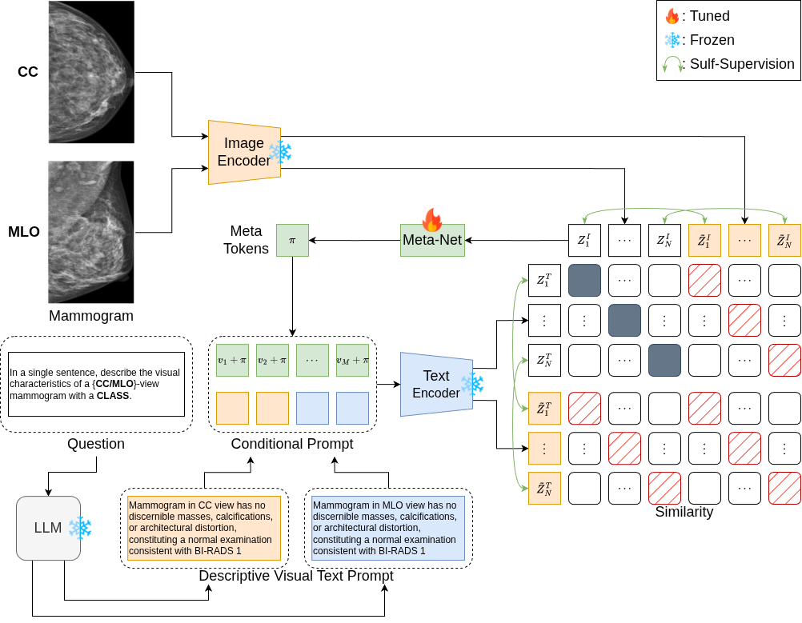

# <div align="center"> Mammo-CoCoOp: Conditional Prompt Learning for Vision-Language Foundation Models in Mammography </div>

<p align="center">
  <a href="https://github.com/batmanlab/Mammo-CLIP">
    
  </a>
  <a href="https://papers.miccai.org/miccai-2024/paper/0926_paper.pdf">
    
  </a>
  <a href="https://arxiv.org/abs/2203.05557">
    
  </a>
  <a href="https://huggingface.co/shawn24/Mammo-CLIP/tree/main/Pre-trained-checkpoints/">
    
  </a>
  <a href="https://www.kaggle.com/datasets/shantanughosh/vindr-mammogram-dataset-dicom-to-png">
    
  </a>
</p>

---

## Overview

**Mammo-CoCoOp** extends [Mammo-CLIP](https://github.com/batmanlab/Mammo-CLIP) (MICCAI 2024) with a contrastive learning adaptation of [Conditional Context Optimization (CoCoOp)](https://arxiv.org/abs/2203.05557) (CVPR 2022). Instead of using static zero-shot text prompts, Mammo-CoCoOp learns **image-conditional prompts** through a lightweight Meta-Net.

### Key Contributions
- **Contrastive Fine-Tuning with LLMs**: Unlike standard CoCoOp which uses downstream classification (Cross-Entropy), Mammo-CoCoOp performs **Contrastive Learning (InfoNCE)**. It aligns each mammogram with its specific, highly-detailed LLM-generated radiology description (e.g., density and BI-RADS findings).
- **Adapts CoCoOp to Bio_ClinicalBERT**: We adapt CoCoOp for Mammo-CLIP's Bio_ClinicalBERT text encoder by injecting learnable prompt embeddings via HuggingFace's `inputs_embeds` parameter.
- **Zero-Shot Downstream Evaluation**: After the Meta-Net and Context Vectors are contrastively trained to align with detailed LLM descriptions, the model performs zero-shot classification on downstream tasks (Mass, Calcification, Density) using fixed, class-specific LLM templates.
- **Fully frozen backbone**: Both the image encoder (EfficientNet B5/B2) and text encoder (Bio_ClinicalBERT) remain completely frozen. Only the context vectors and Meta-Net are trained (~100K parameters).

### Architecture

<p align="center">
  
</p>

**Learnable (🔥 Tuned):** Context vectors `v₁, v₂, ..., vₘ` + Meta-Net  
**Frozen (❄️):** Image encoder, Text encoder, LLM  

---

## Table of Contents

1. [Environment Setup](#environment-setup)
2. [Data Download](#data-download)
3. [Mammo-CLIP Checkpoints](#mammo-clip-checkpoints)
4. [CoCoOp Training](#cocoop-training)
5. [Project Structure](#project-structure)
6. [Citation](#citation)
7. [License](#license)
8. [Acknowledgements](#acknowledgements)

---

## Environment Setup

Use [environment.yml](environment.yml) to set up the environment.

```bash
git clone https://github.com/Deep-Learning-Media-System-Laboratory/Mammo-CoCoOp.git
cd Mammo-CoCoOp
conda env create --name mammo-cocoop -f environment.yml
conda activate mammo-cocoop
```

**Requirements:**
- Python 3.8+
- PyTorch 2.2+
- CUDA 11.8+
- GPU: NVIDIA RTX 3080 (20GB) or higher recommended

If you encounter the `punkt_tab` error:
```python
import nltk
nltk.download('punkt_tab')
```

---

## Data Download

### VinDr Mammogram Dataset (PNG)

Download the pre-processed PNG images from Kaggle:

```bash
pip install kaggle
kaggle datasets download -d shantanughosh/vindr-mammogram-dataset-dicom-to-png \
    -p /path/to/data/vindr/ --unzip
```

The CSV annotation file [vindr_detection_v1_folds.csv](src/codebase/data_csv/vindr_detection_v1_folds.csv) is already included in this repository.

### Expected Data Structure

```
data/
└── vindr/
    ├── vindr_detection_v1_folds.csv
    └── images_png/
        ├── <study_id_1>/
        │   ├── <image_id_1>.png
        │   └── <image_id_2>.png
        └── <study_id_2>/
            ├── <image_id_3>.png
            └── <image_id_4>.png
```

---

## Mammo-CLIP Checkpoints

Download the pre-trained Mammo-CLIP checkpoints from Hugging Face:

| Model | Checkpoint |
|-------|------------|
| EfficientNet-B5 (best performance) | [b5-model-best-epoch-7.tar](https://huggingface.co/shawn24/Mammo-CLIP/blob/main/Pre-trained-checkpoints/b5-model-best-epoch-7.tar) |
| EfficientNet-B2 (lightweight) | [b2-model-best-epoch-10.tar](https://huggingface.co/shawn24/Mammo-CLIP/blob/main/Pre-trained-checkpoints/b2-model-best-epoch-10.tar) |

Place checkpoints in:
```
checkpoints/pretrained/
├── b5-model-best-epoch-7.tar
└── b2-model-best-epoch-10.tar
```

---

## CoCoOp Training

### Quick Start

Train CoCoOp with the B5 backbone for Mass classification:

```bash
python src/codebase/train_cocoop.py \
    --clip_chk_pt_path checkpoints/pretrained/b5-model-best-epoch-7.tar \
    --label Mass \
    --batch-size 4 \
    --epochs 50 \
    --output_path outputs/cocoop/b5/Mass
```

### Run All Experiments

Shell scripts are provided to train across all labels (Mass, Calcification, Malignancy, Density):

```bash
# B5 backbone on GPU 0
bash src/scripts/run_cocoop_b5.sh 0

# B2 backbone on GPU 1
bash src/scripts/run_cocoop_b2.sh 1

# Run both in parallel (one per GPU)
bash src/scripts/run_cocoop_b5.sh 0 &
bash src/scripts/run_cocoop_b2.sh 1 &
wait
```

### Command-Line Arguments

| Argument | Default | Description |
|----------|---------|-------------|
| `--clip_chk_pt_path` | *required* | Path to pre-trained Mammo-CLIP checkpoint (.tar) |
| `--label` | `Mass` | Target label for zero-shot evaluation (`Mass`, `Suspicious_Calcification`, `Malignancy`, or `density`) |
| `--n_ctx` | `4` | Number of learnable context tokens |
| `--ctx_init` | `""` | Context initialization string (empty = random init) |
| `--meta_net_reduction` | `16` | Meta-Net bottleneck reduction factor |
| `--batch-size` | `4` | Training batch size |
| `--epochs` | `50` | Maximum training epochs |
| `--lr` | `0.002` | Learning rate (SGD) |
| `--patience` | `10` | Early stopping patience (0 = disabled) |
| `--data_frac` | `1.0` | Fraction of training data to use |
| `--prompts_csv` | `vindr/clip_vindr_final_prompts.csv` | CSV containing LLM descriptions for Contrastive Training |
| `--labels_csv` | `vindr/vindr_detection_v1_folds.csv` | CSV containing ground-truth labels for Zero-Shot Evaluation |
| `--output_path` | *required* | Output directory for checkpoints and results |

### Training Prompts (Contrastive Learning)

During training, Mammo-CoCoOp reads the highly detailed, per-image radiology descriptions generated by an LLM (GPT-5). These are stored in the `cc_prompt` and `mlo_prompt` columns of `clip_vindr_final_prompts.csv`. 

For example, a single mammogram might be aligned with the following prompt during the InfoNCE contrastive pass:
> *"In the CC view, heterogeneously dense fibroglandular tissue (ACR density C) is present with no discernible masses, calcifications, or architectural distortion, constituting a normal examination consistent with BI-RADS 1."*

### Zero-Shot Evaluation Templates

During the evaluation loop, the model relies on the learned Meta-Net to dynamically generate context tokens for fixed, class-specific LLM templates. These templates match the style of the training descriptions:

| Task | Class 0 (Negative) Template | Class 1 (Positive) Template |
|------|-----------------------------|-----------------------------|
| **Mass** | *"A mammogram showing no discernible masses, calcifications, or architectural distortion, constituting a normal examination."* | *"A mammogram showing a discernible mass, requiring further clinical evaluation."* |
| **Calcification** | *"A mammogram showing no discernible masses, calcifications, or architectural distortion, constituting a normal examination."* | *"A mammogram showing suspicious calcifications, requiring further clinical evaluation."* |
| **Malignancy** | *"A mammogram showing no evidence of malignancy, consistent with benign or normal findings (BI-RADS 1 to 3)."* | *"A mammogram showing suspicious findings highly suggestive of malignancy, requiring further clinical evaluation (BI-RADS 4 or 5)."* |

*(Density uses four distinct templates matching ACR density grades A through D).*

### Output Structure

```
outputs/cocoop/{b5,b2}/{label}/
├── checkpoints/
│   └── cocoop_best.pth                  # Best prompt_learner weights
├── tb_logs/                              # TensorBoard logs
├── train_config.json                     # Training configuration
├── cocoop_{label}_predictions.csv        # Test set predictions
└── cocoop_{label}_summary.json           # Results summary
```

### Training Details

| Parameter | Value |
|-----------|-------|
| Optimizer | SGD (lr=0.002, momentum=0.9, weight_decay=5e-4) |
| Scheduler | Cosine annealing with 1-epoch warmup |
| Batch size | 4 |
| Max epochs | 50 (early stopping patience=10) |
| Context tokens | 4 |
| Meta-Net | 2-layer bottleneck (16× reduction) |
| Loss | Cross-entropy |

---


## Project Structure

```
Mammo-CoCoOp/
├── environment.yml                          # Conda environment
├── README.md                                # This file
│
├── src/
│   ├── codebase/
│   │   ├── cocoop/                          # CoCoOp modules (NEW)
│   │   │   ├── __init__.py
│   │   │   ├── prompt_learner.py            # MammoPromptLearner (ctx + Meta-Net)
│   │   │   └── mammo_cocoop.py              # MammoCoCoOp model wrapper
│   │   │
│   │   ├── train_cocoop.py                  # CoCoOp training script (NEW)
│   │   │
│   │   ├── breastclip/                      # Mammo-CLIP core (unchanged)
│   │   │   ├── model/
│   │   │   │   ├── clip.py                  # BreastClip model
│   │   │   │   └── modules/                 # Encoders, projections
│   │   │   └── evaluator.py                 # Zero-shot evaluator
│   │   │
│   │   ├── Classifiers/                     # Downstream classifiers (unchanged)
│   │   ├── Datasets/                        # Dataset classes (unchanged)
│   │   ├── configs/                         # Hydra configs (unchanged)
│   │   ├── data_csv/                        # CSV annotation files
│   │   ├── train_classifier.py              # LP/FT training (unchanged)
│   │   └── eval_zero_shot_clip.py           # ZS evaluation (unchanged)
│   │
│   ├── scripts/
│   │   ├── run_cocoop_b5.sh                 # CoCoOp B5 training (NEW)
│   │   ├── run_cocoop_b2.sh                 # CoCoOp B2 training (NEW)
│   │   └── ...                              # Other scripts
│   │
│   └── preprocessing/                       # Image preprocessing
│
└── CoOp/                                    # CoCoOp reference codebase
    └── trainers/cocoop.py                   # Original CoCoOp implementation
```

---

## Citation

If you use this work, please cite both papers:

```bibtex
@InProceedings{ghosh2024mammoclip,
  author    = {Ghosh, Shantanu and Poynton, Clare B. and Visweswaran, Shyam and Batmanghelich, Kayhan},
  title     = {Mammo-CLIP: A Vision Language Foundation Model to Enhance Data Efficiency and Robustness in Mammography},
  booktitle = {Medical Image Computing and Computer Assisted Intervention -- MICCAI 2024},
  year      = {2024},
  publisher = {Springer Nature Switzerland},
  pages     = {632--642},
}

@InProceedings{zhou2022cocoop,
  author    = {Zhou, Kaiyang and Yang, Jingkang and Loy, Chen Change and Liu, Ziwei},
  title     = {Conditional Prompt Learning for Vision-Language Models},
  booktitle = {IEEE/CVF Conference on Computer Vision and Pattern Recognition (CVPR)},
  year      = {2022},
  pages     = {16816--16825},
}
```

---

## License

This project is licensed under the **Creative Commons Attribution–NonCommercial–ShareAlike 4.0 International (CC BY-NC-SA 4.0)** license.

You may use, share, and adapt this work for **non-commercial research and educational purposes only**, provided that you:

- Give appropriate credit to the original authors.
- Indicate if changes were made.
- Distribute any derivative works under the same license (CC BY-NC-SA 4.0).

**Commercial use is strictly prohibited.**

Copyright © [Deep Learning Media System Laboratory](https://github.com/Deep-Learning-Media-System-Laboratory), 2025  
Original Mammo-CLIP Copyright © [Batman Lab](https://www.batman-lab.com/), 2024  
License: [CC BY-NC-SA 4.0](https://creativecommons.org/licenses/by-nc-sa/4.0/)

---

## Acknowledgements

- [Mammo-CLIP](https://github.com/batmanlab/Mammo-CLIP) by Shantanu Ghosh et al. (Batman Lab, Boston University)
- [CoCoOp / CoOp](https://github.com/KaiyangZhou/CoOp) by Kaiyang Zhou et al.
- [VinDr-Mammo](https://vindr.ai/datasets/mammo) dataset

---

## Contact

For questions about this repository, please open an [issue](https://github.com/Deep-Learning-Media-System-Laboratory/Mammo-CoCoOp/issues).
